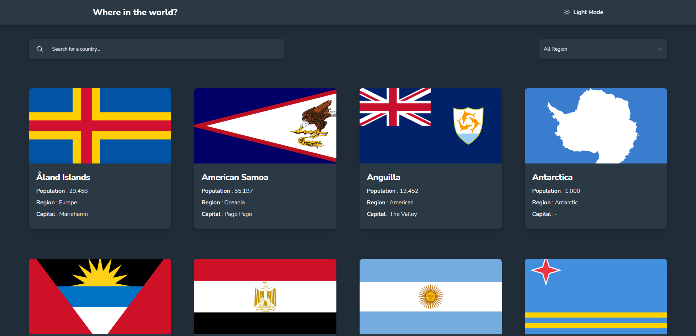

# Frontend Mentor - REST Countries API with color theme switcher solution

This is a solution to the [REST Countries API with color theme switcher challenge on Frontend Mentor](https://www.frontendmentor.io/challenges/rest-countries-api-with-color-theme-switcher-5cacc469fec04111f7b848ca). Frontend Mentor challenges help you improve your coding skills by building realistic projects. 

## Table of contents

- [Overview](#overview)
  - [The challenge](#the-challenge)
  - [Screenshot](#screenshot)
  - [Links](#links)
- [My process](#my-process)
  - [Built with](#built-with)
  - [What I learned](#what-i-learned)
  - [Continued development](#continued-development)
  - [Useful resources](#useful-resources)
- [Author](#author)
- [Acknowledgments](#acknowledgments)

## Overview

### The challenge

Users should be able to:

- See all countries from the API on the homepage
- Search for a country using an `input` field
- Filter countries by region
- Click on a country to see more detailed information on a separate page
- Click through to the border countries on the detail page
- Toggle the color scheme between light and dark mode *(optional)*

### Screenshot

### Links

- Live Site URL: [Rest Country API](https://rest-countries-api-brilliant.vercel.app/)
- Solution URL: [Github Repo](https://github.com/RandyBrilliant/rest-countries-api)

## My process

### Built with

- [React](https://reactjs.org/) - JS Library
- [Tailwind CSS](https://tailwindcss.com/) - CSS Framework
- [React Router](https://reactrouter.com/) - React.js Library
- [Parcel](https://parceljs.org//) - Build Tools
- [ESLint](https://eslint.org/) - JS Linter

### What I learned

This is the first time I am developing an app with ReactJS from scratch, by means rather than using the usual `create-react-app`, I try to build the React App from empty npm package. Yeah, it's a tough way to get there, but trust me, you will learn a lot of how React is created under the hood and you can choose which package to be included to your project to maximize your workflow. And I think this method is kinda unique as nowadays it's hard to find tutorial or guide to learn React the hard way. In this project also features `dark mode` utility where it's my first time developing it and `Tailwind CSS` does a great job in providing the functionality.

### Continued development

There's a lot of improvement there, such as the design and the messy code that I have put inside. So I will improve the code in the future.

### Useful resources

- [Dark Mode](https://www.joshwcomeau.com/react/dark-mode/) - This helped me for dark mode reason. I really liked this pattern and will use it going forward.
- [Async and Await](https://javascript.info/async-await) - This is an amazing article which helped me finally understand async and await. I'd recommend it to anyone still learning this concept.

## Author

- LinkedIn - [Randy Brilliant](https://www.linkedin.com/in/randybrilliant22/)
- Frontend Mentor - [@randybrilliant](https://www.frontendmentor.io/profile/RandyBrilliant)
- Instagram - [@randybrilliant](https://www.instagram.com/randybrilliant)

## Acknowledgments

Special thanks to [Brian Holt](https://github.com/btholt), an ex-employee at Microsoft and currently the PM of Stripe in providing this amazing workshop of Intro to React at Frontend Masters. He has been an amazing instructor in giving me in depth explanation of how React works under the hood and grasp the fundamental of React. You can check the course below.

- [Frontend Masters](https://frontendmasters.com/courses/complete-react-v6/) - Complete Intro to React, v6
